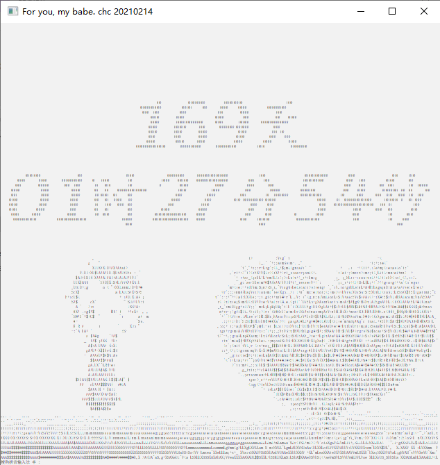
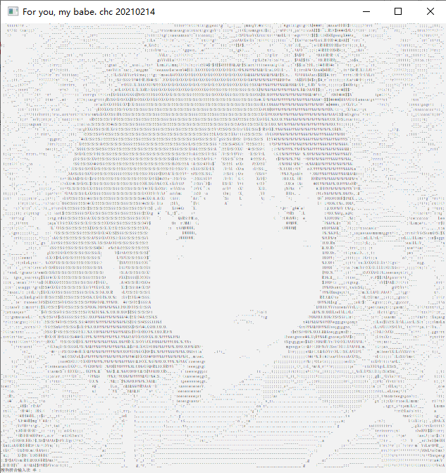

# 字幅图动画

## 描述
> + 字符动画：多副字符画动态切换。
> + 展示时间 ： 显示在一起的时间，随时间实时改变。 
>  + 其他：生日当天现实生日动画，情人节有情人节动画等。

## 使用说明

> ### img2char
>
> > + **功能：** 将图片转化为字符图
> > + **参数：** --path 图片文件夹路径  --output 输出文件名 输出转换结果
> > + **使用：** python img_to_char_img.py --path ./imgs --output char_imgs.txt
>
> ### foryou
>
> > + **功能：** 展示字符图画
> >
> > + **配置：** 通过foryou文件夹下的config.txt配置信息，有两个配置参数:
> >
> >    1. birthday:yyyymmdd   // 生日用于生日当天现实生日动画
> >    2. starttime:yyyymmdd:hhmmss //现实距离该时间的实时时间 
> >
> > + **展示**
> >
> >    
 

> >
> >    
 

> >
> >    
 

